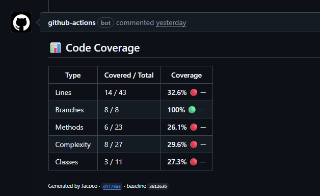
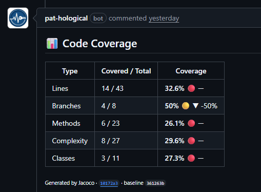
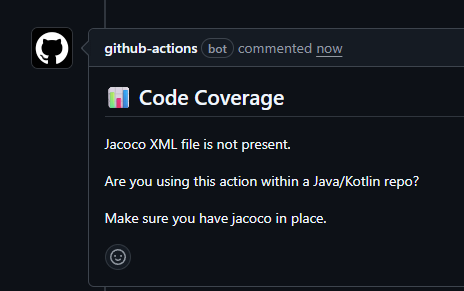

# jacoco-reporter-action

Github action that will publish the result of JaCoCo report as a PR comment. This is helpful to make sure your changes are properly tested and code coverage stays in an acceptable range.

## Usage

Create a workflow inside your github directory (`.github/workflows`). An example workflow is available below. If you need assistance creating a workflow, take a look at the official documentation regarding [github actions and workflows](https://docs.github.com/en/actions/get-started/quickstart).

### Inputs

| Name             | Description                                                                                                                                                  | Default value                 | Mandatory |
| ---------------- | ------------------------------------------------------------------------------------------------------------------------------------------------------------ | ----------------------------- | --------- |
| github-token     | Flow token used to add comments and/or push files to branch. Can be the default token created by PR workflow or can be replaced with PAT or github app token | ${{ github.token }}           | No        |
| jacoco-xml-path  | Path to jacoco.xml file                                                                                                                                      | target/site/jacoco/jacoco.xml | No        |
| enable-baseline  | Flag to activate baseline file creation. This allows the action to add a delta on every comment                                                              | false                         | No        |
| baseline-path    | Path where the baseline file is stored or will be created at. If set, `enable-baseline` has to be enabled as well                                            | .github/jacoco-baseline.json  | No        |
| baseline-branch  | Name of the branch used as ref. Usually it is main/master. If set, `enable-baseline` has to be enabled as well                                               | main                          | No        |
| update-pr-author | The author name used to prevent infinite loops. If `enable-baseline` is enabled this has to be customized                                                    | github-actions[bot]           | No        |

### Outputs

- `line-coverage`: Line coverage percentage
- `branch-coverage`: Branch coverage percentage
- `method-coverage`: Method coverage percentage
- `complexity-coverage`: Complexity coverage percentage
- `class-coverage`: Class coverage percentage

## Example workflows

### Minimal setup

```yml
name: Build check

on:
  push:
    branches: ["main"]
  pull_request:
    branches: ["main"]

jobs:
  build:
    runs-on: ubuntu-latest

    steps:
      - uses: actions/checkout@v4

      - name: Set up JDK 21
        uses: actions/setup-java@v4
        with:
          java-version: "21"
          distribution: "temurin"
          cache: maven

      - name: Build with Maven
        run: mvn -B package --file pom.xml

      - name: Jacoco coverage check
        uses: jacklu97/jacoco-reporter-action@v1.0.0
```

### Baseline configuration

```yml
name: Build check

on:
  push:
    branches: ["main"]
  pull_request:
    branches: ["main"]

jobs:
  build:
    runs-on: ubuntu-latest

    steps:
      - uses: actions/checkout@v4

      - name: Set up JDK 21
        uses: actions/setup-java@v4
        with:
          java-version: "21"
          distribution: "temurin"
          cache: maven

      - name: Build with Maven
        run: mvn -B package --file pom.xml

      # This can be omitted if you set a PAT in secrets
      - uses: actions/create-github-app-token@v1
        id: app-token
        with:
          app-id: ${{ secrets.PAT_HOLOGICAL_ID }}
          private-key: ${{ secrets.PAT_HOLOGICAL_KEY }}

      - name: Jacoco coverage check
        uses: jacklu97/jacoco-reporter-action@v1.0.0
        with:
          enable-baseline: true                              # Only critical flag for baseline
          github-token: ${{ steps.app-token.outputs.token }} # This can be omitted if you set a PAT in secrets
          update-pr-author: pat-hological[bot]               # Or whatever author you set
```

⚠️ Note that it is required to enable jacoco in your pom file for this to action to properly work

## Possible outcomes

### Simple comment



### Comment with delta - baseline is enabled



### No jacoco file found



⚠️ The autor of the comment depends on the github-token parameter value

## FAQ

- I added baseline configuration and workflows are not re-run after baseline file is updated
  - This is an expected behavior due how github works with updates from bots. This is meant to prevent infinite loops. To address this, set a PAT instead of github-token or use an app token
- I used an app token and I'm stuck within an infinite loop
  - This happens due a missmatch between the update commit author and the `update-pr-author` parameter value. This has to be customized to prevent the infinite loop

## Licence

The scripts and documentation in this project are released under the [MIT licence](./LICENSE)
